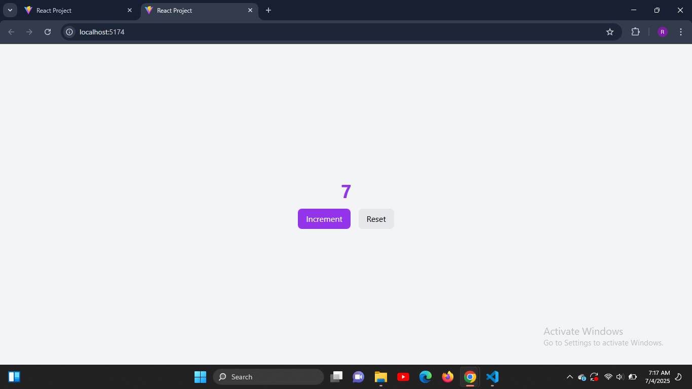

# Day 2 - React Counter App

This is Day 2 of my 30-Day React Relearning Journey. Today’s focus was learning about **React state** using the `useState` hook and handling button events to update the UI.

---

## 🚀 What I Learned

✅ How to manage component state with `useState`  
✅ How React re-renders components when state changes  
✅ How to handle events like `onClick`  
✅ How to use Framer Motion for interactive button animations  
✅ How to combine Tailwind CSS with React for clean UI

---

## 📦 Features

- A visible counter
- "Increment" and "Reset" buttons
- Smooth button scaling with Framer Motion

---

## 🧠 Tech Stack

- React (JavaScript)
- Tailwind CSS
- Framer Motion

---

## 📸 Preview



---

## 🛠️ Installation

```bash
git clone https://github.com/Qasim-Rokeeb/counter-app.git
cd counter-app
npm install
npm run dev

🌐 Live Demo

Hosted on Vercel: https://qasimrokeeb-counter-app.vercel.app

Made with 💻 by Qasim Rokeeb